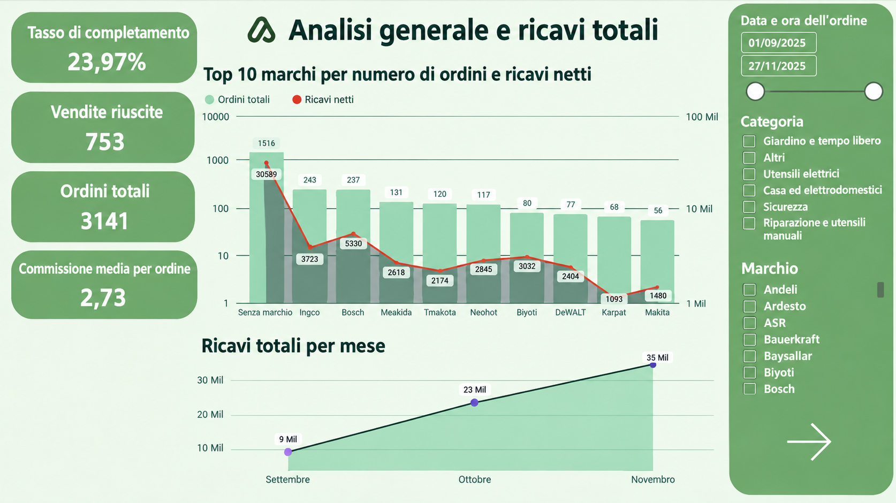
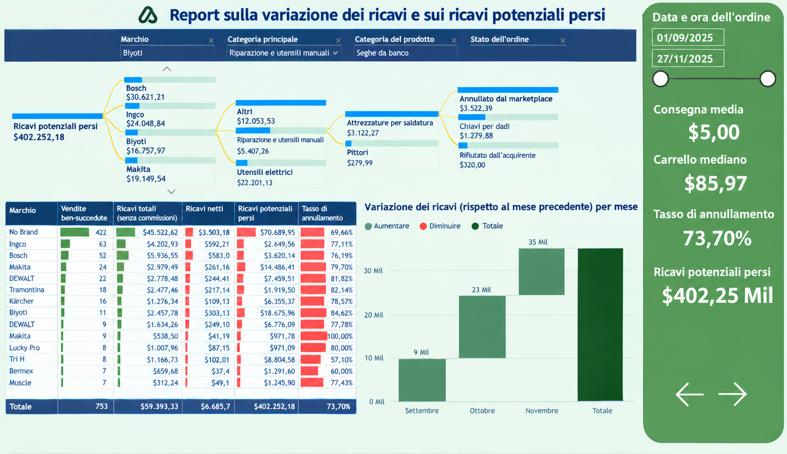

# Power BI Progetti del portfolio

Benvenuti nel mio portfolio di progetti Power BI.

Qui troverai una raccolta di dashboard e progetti sviluppati per mostrare le mie competenze in **Business Intelligence, analisi e visualizzazione dei dati**. Questi progetti esplorano vari scenari aziendali, evidenziando l’applicazione pratica dei dati per generare approfondimenti e supportare il processo decisionale.

Il contenuto è disponibile in **inglese, portoghese e italiano**.
---
- [<ins><b>©2026 Vinícius Oliveira. All rights reserved</b></ins>]()
---
## Project 1: Sales Dashboard

Questo progetto presenta una serie di dashboard interattive sviluppate per monitorare indicatori strategici relativi alle vendite, ai ricavi e al comportamento dei clienti.

**Analisi principali:**

-  Panoramica degli ordini, dei ricavi netti e del tasso di conversione.
-  Classifica dei marchi con le migliori prestazioni in termini di vendite e fatturato.
-  Analisi dell'andamento dei ricavi nel tempo.
-  Valutazione delle prestazioni di vendita per metodo di pagamento e categoria di prodotto.
-  Monitoraggio delle cancellazioni e del loro impatto economico.

## Preview

  

  

  

Per visualizzare il contenuto in altre lingue, clicca qui:

[us Português](README.pt-BR.md) | [🇮🇹 Inglese](README.md)

## Project 2: Sales Dashboard

## Preview

## Project 3: Sales Dashboard

## Preview

## Project 4: Sales Dashboard

## Preview

## Project 4: Sales Dashboard

## Preview
