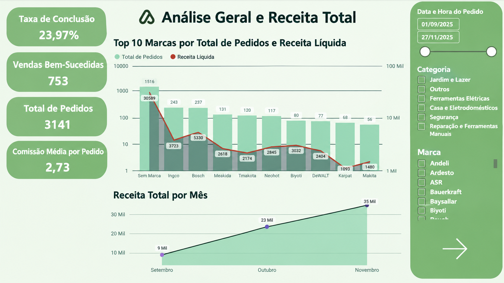
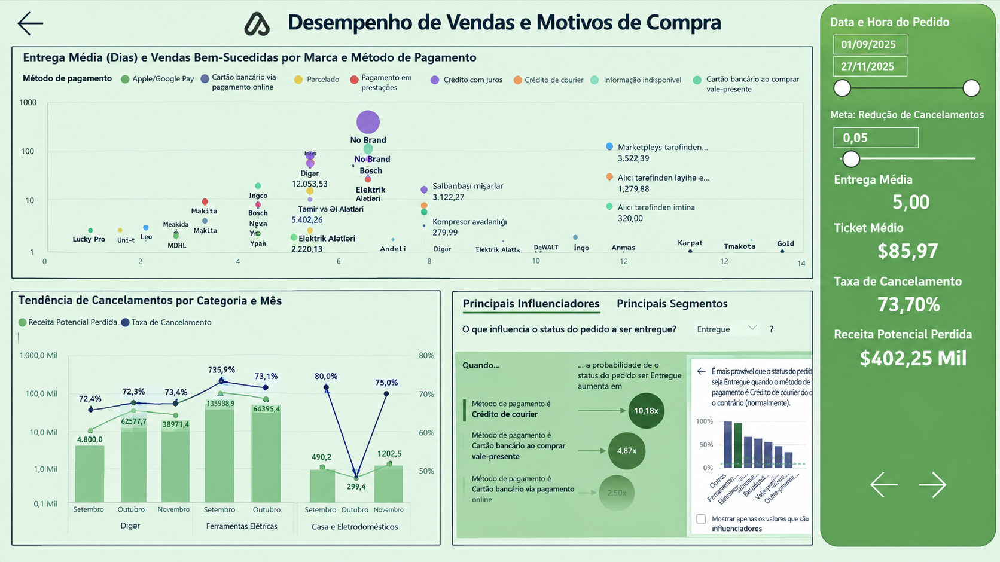
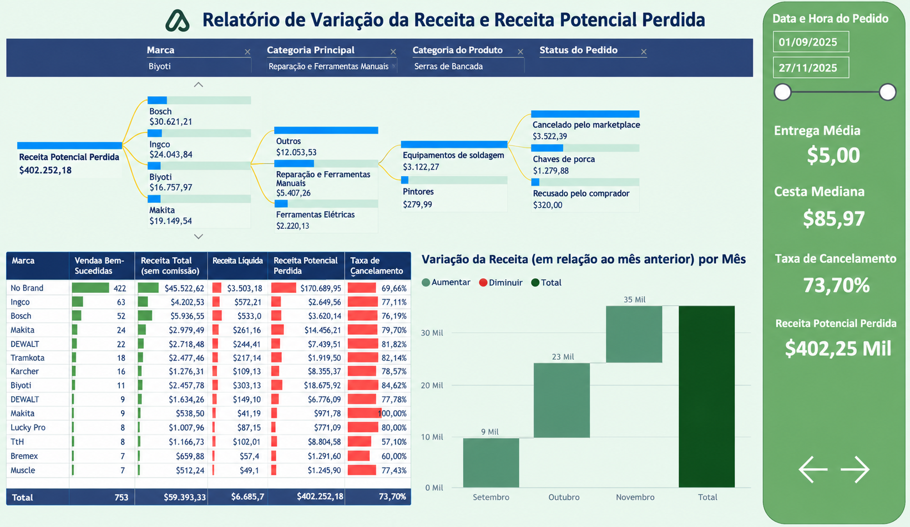

# Power BI Portfolio Projects

Welcome to my Power BI project portfolio.

Here, you will find a collection of dashboards and projects developed to showcase my skills in **Business Intelligence, data analysis, and data visualization**. These projects explore various business scenarios, highlighting the practical application of data to generate insights and support decision-making.

The content is available in **English, Portuguese, and Italian**.

---
- [<ins><b>©2026 Vinícius Oliveira. All rights reserved</b></ins>]()
---
## Project 1: Sales Dashboard

### 🇺🇸 English

This project features a set of interactive dashboards designed to monitor key sales, revenue, and customer behavior metrics.

**Key insights:**
-  Overview of orders, net revenue, and conversion rate.
-  Top-performing brands ranked by sales volume and revenue.
-  Monthly revenue trend analysis.
-  Sales performance evaluation by payment method and product category.
-  Cancellation monitoring and financial impact assessment.

---

### 🇧🇷 Português

Projeto de Business Intelligence focado na análise de desempenho comercial, monitoramento de receita, comportamento dos clientes e impacto de cancelamentos. Os dashboards fornecem insights estratégicos para apoiar a tomada de decisões baseada em dados.

**Principais análises:**
-  Visão geral dos pedidos, receita líquida e taxa de conversão.
-  Ranking das principais marcas por volume de vendas e faturamento.
-  Evolução da receita ao longo dos meses.
-  Análise de desempenho comercial por método de pagamento e categoria de produto.
-  Monitoramento de cancelamentos e seus impactos financeiros.

---

### 🇮🇹 Italiano

Questo progetto presenta una serie di dashboard interattive sviluppate per monitorare indicatori strategici relativi alle vendite, ai ricavi e al comportamento dei clienti.

**Analisi principali:**

-  Panoramica degli ordini, dei ricavi netti e del tasso di conversione.
-  Classifica dei marchi con le migliori prestazioni in termini di vendite e fatturato.
-  Analisi dell'andamento dei ricavi nel tempo.
-  Valutazione delle prestazioni di vendita per metodo di pagamento e categoria di prodotto.
-  Monitoraggio delle cancellazioni e del loro impatto economico.

## Preview

  

  

  

## Project 2: Sales Dashboard

## Preview

